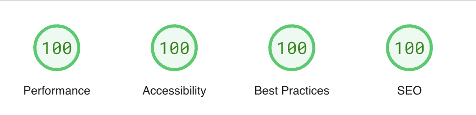

# Homepage

A simple personal [site](https://www.gabi.page) inspired by Notion's design :) 


## SEO

I used [SvelteKit](https://svelte.dev/docs/kit) and pages are pre-rendered to static HTML with SEO best practices. 




Deployed on [Cloudflare Pages](https://pages.cloudflare.com/).


## Developing

```bash
npm install
npm run dev

# or start the server and open the app in a new browser tab
npm run dev -- --open
```

## Building

To create a production version of your app:

```bash
npm run build
```

You can preview the production build with `npm run preview`.

> To deploy your app, you may need to install an [adapter](https://svelte.dev/docs/kit/adapters) for your target environment.
